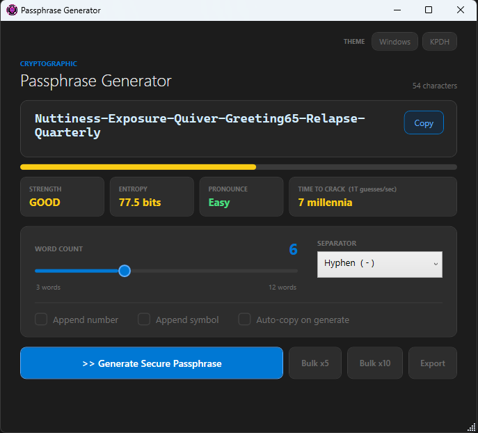
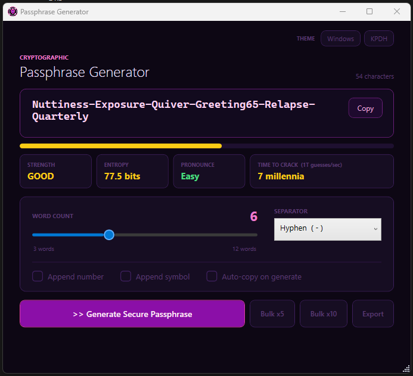
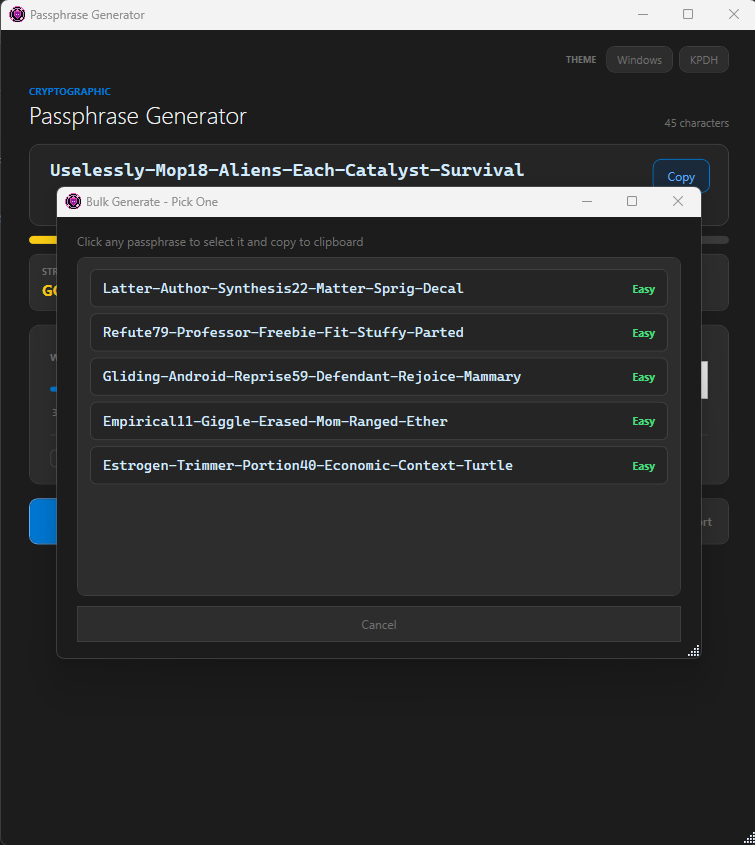
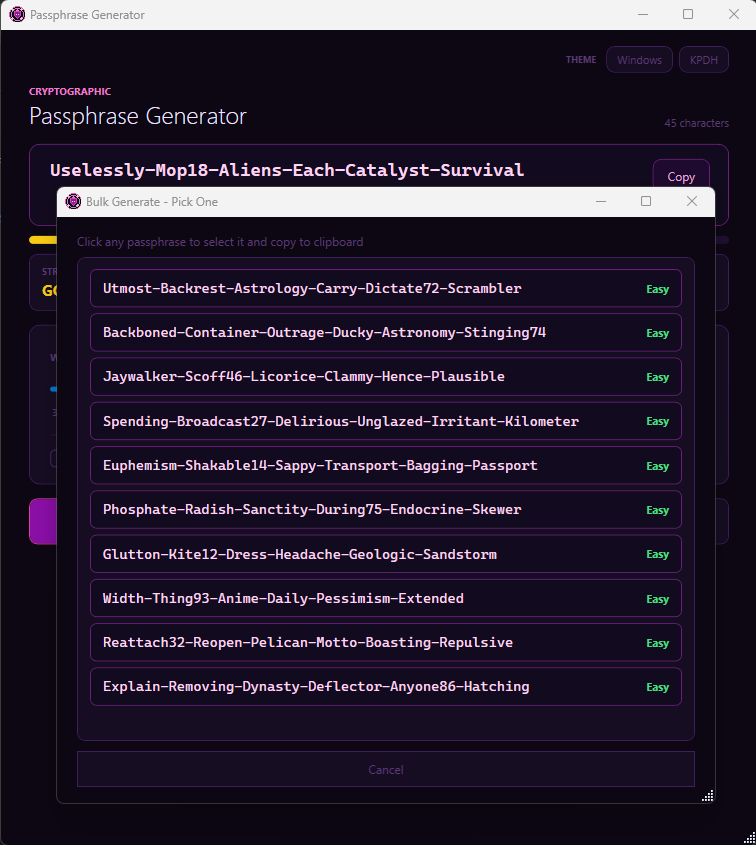

# 🔐 Passphrase Generator

A Windows desktop app for generating secure, memorable passphrases using the [EFF Large Wordlist](https://www.eff.org/files/2016/07/18/eff_large_wordlist.txt). Built with PowerShell + WPF — no install required.


---

## Features

- **Cryptographically random** word selection via `RNGCryptoServiceProvider`
- **EFF Large Wordlist** support — 7,776 words, ~12.9 bits of entropy per word
- **Built-in fallback wordlist** (1,296 words, ~10.3 bits/word) if EFF file is absent
- **Entropy meter** with real-time bit strength display
- **Pronounceability score** shown for each generated passphrase
- **Customizable output** — word count (3–8), separator style, optional number/symbol append
- **Bulk generation** — pick from 5 or 10 passphrases at once
- **Export** — save a batch of 20 passphrases to a `.txt` file
- **Theme support** — auto-detects Windows light/dark mode, plus a KPop Demon Hunters theme 🌸
- **Single instance** — re-focuses the existing window instead of opening a second copy
- **Silent launch** — no PowerShell console window flash

---

## Screenshots






---

## Requirements

- Windows 10 or 11
- PowerShell 5.1 (built into Windows — no download needed)
- .NET Framework 4.x (included with Windows)

---

## Quick Start

### 1. Clone or download

```bash
git clone https://github.com/super-android/passphrase-generator.git
cd passphrase-generator
```

### 2. (Recommended) Add the EFF wordlist

Download [`eff_large_wordlist.txt`](https://www.eff.org/files/2016/07/18/eff_large_wordlist.txt) and place it in the same folder as `PassphraseGen.ps1`. Without it the app still works using the built-in fallback list.

### 3. Run the app

**Double-click `Launch-PassphraseGen.vbs`** — no console window, no UAC prompt.

Or run directly from PowerShell:

```powershell
powershell.exe -NoProfile -ExecutionPolicy Bypass -File .\PassphraseGen.ps1
```

---

## Creating a Desktop Shortcut

1. Right-click `Launch-PassphraseGen.vbs` → **Send to** → **Desktop (create shortcut)**
2. Right-click the new shortcut → **Properties** → **Change Icon...**
3. Browse to `passphrase.ico` → **OK** → **Apply**
4. Rename the shortcut to **Passphrase Generator**

To pin to Taskbar or Start: right-click the shortcut → **Pin to taskbar** / **Pin to Start**

---

## File Reference

| File | Purpose |
|---|---|
| `PassphraseGen.ps1` | Main application |
| `Launch-PassphraseGen.vbs` | Silent launcher (suppresses console window) |
| `passphrase.ico` | App icon |
| `eff_large_wordlist.txt` | _(not included)_ EFF diceware wordlist — see Quick Start |

---

## Entropy Reference

| Words | EFF Wordlist | Fallback List |
|---|---|---|
| 3 | ~38.7 bits | ~30.9 bits |
| 4 | ~51.7 bits | ~41.2 bits |
| 5 | ~64.6 bits | ~51.5 bits |
| 6 | ~77.5 bits | ~61.8 bits |

[NIST recommends](https://pages.nist.gov/800-63-3/sp800-63b.html) a minimum of 112 bits for high-security use. 5+ words from the EFF list comfortably exceeds everyday threat models.

---

## License

MIT — do whatever you want with it.
